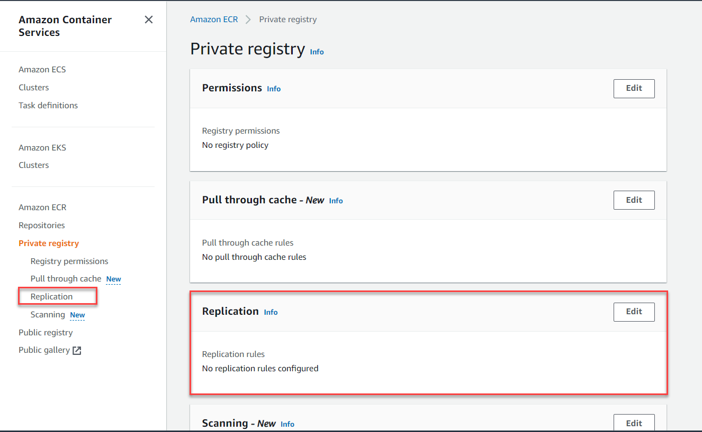

# Working with Docker images and Elastic Container Registry

## Elastic Container Registry
Amazon Elastic Container Registry (Amazon ECR) is a managed container image registry service. You can use the Docker CLI or other similar tools to push or pull images to and from the ECR. It is secure and scalable container registry for maintaining docker images that need to be accessed securely from you AWS and external services. You can create private repositories that provide exclusive access to resources such as EC2 instances and other container orchestration services.

## What Is Amazon Elastic Container Registry Public?
Amazon Elastic Container Registry Public is a managed AWS container image registry service that is secure, scalable, and reliable. Amazon ECR supports public image repositories with resource-based permissions using AWS IAM so that specific users can access your public repositories to push images. Your images are publicly available to pull, either anonymously or using an Amazon ECR Public authentication token.


In this tutorial we will learn how to create an Elastic Container Registry (Private) and push images to it from a local machine. 

## Prerequisites
    * AWS CLI
    * Docker Desktop
    * Visual Studio Code
    * Node JS 14.x or later

## Components of Amazon ECR (Public & Private)
Following are the components of the Elastic Container Registry.
### Amazon ECR Public Gallery
The Amazon ECR Public Gallery is the public portal that lists all public repositories hosted on Amazon ECR Public. Visit the Amazon ECR Public Gallery at [https://gallery.ecr.aws](https://gallery.ecr.aws).
### Registry
For every AWS account an private ECR registry and a public ECR registry is provided. Each account will have a single private ECR registry and a single public ECR registry for each region. You can create one or more image repositories in the registry and provide access to them conditionally. A public registry is provided to each AWS account; you can create public image repositories in your public registry and store images in them.
### Authorization token
Your client must authenticate to Amazon ECR registries as an AWS user before it can push and pull images. Even though you can use the Amazon ECR API to push and pull images, you're more likely to use the Docker CLI or a language-specific Docker library. The Docker CLI doesn't support native IAM authentication methods. Additional steps must be taken so that Amazon ECR can authenticate and authorize Docker push and pull requests. An authorization token's permission scope matches that of the IAM principal used to retrieve the authentication token. An authentication token is used to access any Amazon ECR registry that your IAM principal has access to and is valid for 12 hours. To obtain an authorization token, you must use the GetAuthorizationToken API operation to retrieve a base64-encoded authorization token containing the username AWS and an encoded password. The AWS CLI `get-login-password` command simplifies this by retrieving and decoding the authorization token which you can then pipe into a docker login command to authenticate.
### Repository
An Amazon ECR repository contains your Docker images, Open Container Initiative (OCI) images, and OCI compatible artifacts.
### Repository policy
You can control access to your repositories and the images within them with repository policies.
### Image
You can push and pull container images to your repositories. You can use these images locally on your development system, or you can use them in Amazon ECS task definitions and Amazon EKS pod specifications.

## Pricing for Amazon ECR
With Amazon ECR, you only pay for the amount of data you store in your repositories and for the data transfer from your image pushes and pulls.

## Create ECR using AWS CLI
You can run the following command to create AWS ECR using CLI. Replace the `REGION` and `REPO-NAME` with your AWS region and repository name.

```bash
aws ecr create-repository \
    --repository-name REPO-NAME \
    --image-scanning-configuration scanOnPush=true \
    --region REGION
```

## Authenticate to ECR 
After you have installed and configured the AWS CLI, authenticate the Docker CLI to your default registry. The AWS CLI provides a `get-login-password` command to simplify the authentication process.
When passing the Amazon ECR authorization token to the docker login command, use the value `AWS` for the username and specify the `Amazon ECR registry URI` you want to authenticate to. If authenticating to multiple registries, you must repeat the command for each registry.
```bash
aws ecr get-login-password --region REGION | docker login --username AWS --password-stdin AWS_ACCOUNT_ID.dkr.ecr.region.amazonaws.com
```
Example 
```bash
aws ecr get-login-password --region us-east-1 | docker login --username AWS --password-stdin 123456789012.dkr.ecr.us-east-1.amazonaws.com
```
## Push an image to ECR
We can build and push an image to ECR after successfully logged in to ECR registry. This tutorial uses the `employee-api` microservice application to build the image. You can find the `Dockerfile` in the current project folder. 

1) Run the following command to create a docker image of the employee api application.
    ```bash
    docker build -t employee-api:latest .
    ```
2) You need to tag the image before uploading it to ECR. Use the ECR URI as a prefix for the docker image to tag.
    ```bash
    docker tag employee-api:latest 396789241442.dkr.ecr.us-east-1.amazonaws.com/employee-api:latest
    ```
3) Use the `docker push` command to upload the image to ECR.
    ```bash
    docker push 396789241442.dkr.ecr.us-east-1.amazonaws.com/employee-api:latest
    ```

## Enable image replication
Amazon ECR uses registry settings to configure private image replication at the registry level. An Amazon ECR private registry can be configured for either cross-Region or cross-account replication. Replication is configured for a private registry separately for each Region. 
### Cross-Region replication
Enabling cross-Region replication for your registry makes copies of the repositories in one or more destination Regions. Only images pushed to a repository after cross-Region replication is configured are copied.
### Cross-account replication
Enabling cross-account replication for your registry makes copies of the repositories in the destination account and Regions you specify. For cross-account replication to occur, the destination account must configure a registry permissions policy to allow replication from your registry to occur.

Perform the following steps to enable replication:

1) Navigate to the ECR private repositories page
2) From the navigation bar, choose the Region to configure your registry replication settings for.
3) In the navigation pane, choose `Private registry`.

    

4) On the Private registry page, on the Replication section, choose `Edit`.
5) On the Replication page, choose `Add replication rule`.
6) On the Destination types page, choose whether to enable cross-Region replication, cross-account replication, or both and then choose `Next`.
7) If cross-Region replication is enabled, then for Configure destination regions, choose one or more Destination regions and then choose Next.
8) If cross-account replication is enabled, then for Cross-account replication, choose the cross-account replication setting for the registry. For Destination account, enter the account ID for the destination account and one or more Destination regions to replicate to. Click `Destination account +` button to configure additional accounts as replication destinations.
9) On the Add filters page, specify one or more filters for the replication rule and then choose Add. This is optional.
10) On the Review and submit page, review the replication rule configuration and then choose `Submit rule`.

> [!IMPORTANT]
> This application uses AWS DynamoDB as the database storage. When you deploy the containerized application inside Elastic Beanstalk, you need to provide access permission to DynamoDB for your EC2 instance running for Beanstalk. To provide DynamoDB access update the `aws-elasticbeanstalk-ec2-role` role in IAM to add `AmazonDynamoDBFullAccess` policy.